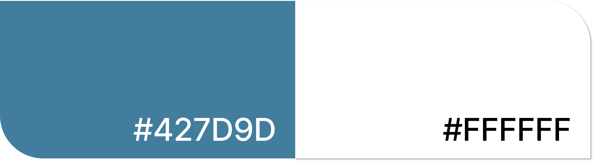
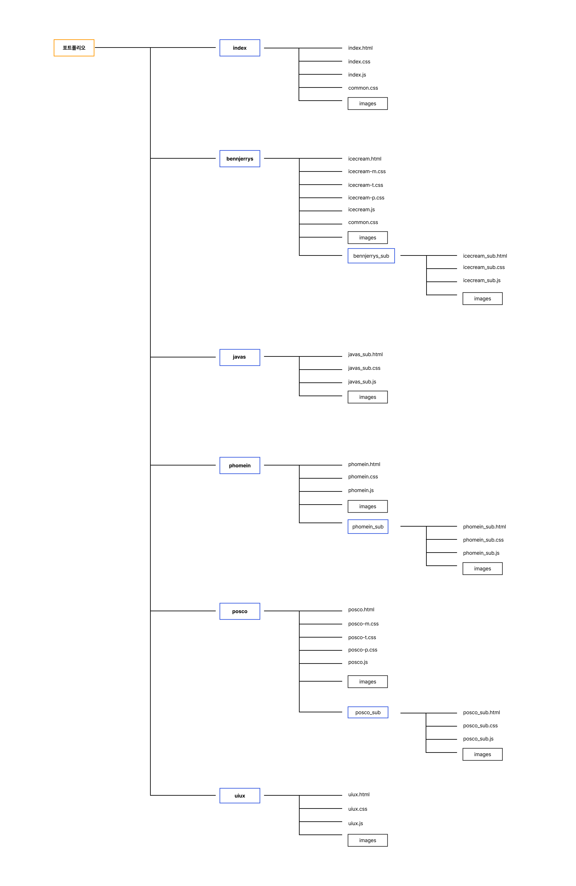

# SUMIN'S PORTFOLIO🍉
👉 2023.03.08 ~ 2023.08.03 '웹디자인 및 스마트 UI/UX 웹퍼블리셔' 과정 수료 
👉 포트폴리오 제작 포함 총 6번의 프로젝트를 진행하였습니다.

## Overview
-   목표
    - 깔끔하고 보기 편안한 포트폴리오 제작하기
    

## 진행과정
- index 파일 생성 및 포트폴리오 폴더 구성
	 - 6/21 포트폴리오 index 리디자인 하기
    - 포트폴리오 퍼블리싱 
    - 각 프로젝트 서브 페이지 제작

- 04/24 - 05/31 팀 프로젝트(이거왜안되조) / 자립해냄 앱 UI/UX 리디자인
    - 앱 선정 및 구조 분석
    - 정보구조도 작성 
    - 와이어 프레임 + 워크플로우 제작
    - 스타일 가이드 및 프로토타입 제작
    - 프로젝트 완성

-  06/08 - 06/15 개인 프로젝트(반응형) / 포스코
    - 래퍼런스 사이트 찾기 & 리디자인하기
    - 스타일 가이드 제작
    - 모바일 우선순위로 태블릿 버전, pc 버전까지 퍼블리싱
    
 - 06/30 - 07/10 팀 프로젝트(자바스) / 베이힐풀앤빌라
    - 래퍼런스, 리디자인 사이트 선정
    - 리디자인 최종 완성, 컨펌 및 퍼블리싱 가이드 작성
    - 퍼블리싱 가이드 컨펌 및 폴더 정리 완료
    - 퍼블리싱 및 서브 페이지 연결, 프로젝트 완료

 - 07/21 - 07/26 개인 프로젝트 / 포메인
    - 래퍼런스 사이트 찾기 & 리디자인 하기
    - 스타일 가이드 제작
    - 퍼블리싱
    
 - 07.27 - 08/02 개인 프로젝트(반응형) / 밴앤제리스
    - 래퍼런스 사이트 찾기 & 리디자인 하기
    - 스타일 가이드 제작
    - 퍼블리싱
 
 
## Design
- keyword
	- 깔끔함
	- 편안함
	- 정보전달
	
- Color

- Typography
	- Pretendard Variable / TTWanjudaedunsancheB

## Publishing
- flex를 활용한 레이아웃 정렬
- @font-face 적용하여 폰트 제공
- JavaScript 이용한 슬라이드 배너 제작
- animation 사용하여 움직임을 추가하여 시각적 흥미 요소 추가

## 포트폴리오 구성도

