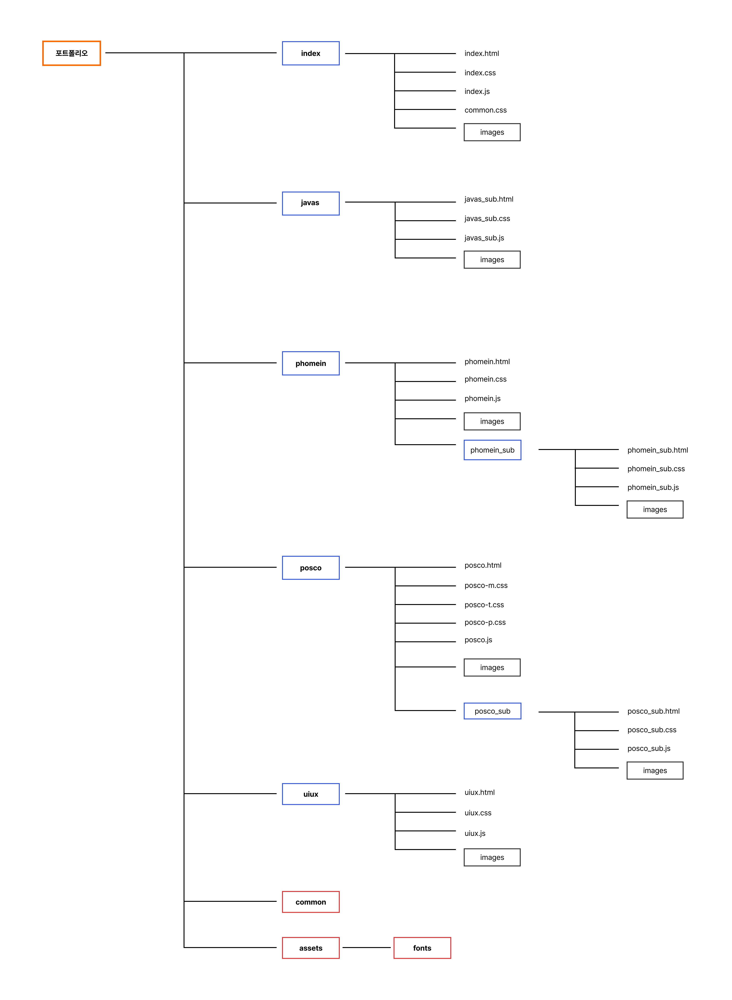

## SUMIN'S PORTFOLIO🍉

 ## `Overview`
****🔹 목표**** 
 심플하고 보기 편안한 포트폴리오 제작하기
    
 ##  `Project`
 **🔹 04/24 - 05/31 팀 프로젝트 (이거왜안되조)** &nbsp;&nbsp;&nbsp;&nbsp;&nbsp;&nbsp;자립해냄 앱 UI/UX 리디자인
 
**🔹 06/08 - 06/15 개인 프로젝트**   &nbsp;&nbsp;&nbsp;&nbsp;&nbsp;&nbsp;포스코 리디자인과 퍼블리싱

**🔹 06/30 - 07/10 팀 프로젝트 (javas)**   &nbsp;&nbsp;&nbsp;&nbsp;&nbsp;&nbsp;베이힐풀앤빌라 사이트 리디자인과 퍼블리싱
 
 **🔹 07/21 - 07/26 개인 프로젝트**   &nbsp;&nbsp;&nbsp;&nbsp;&nbsp;&nbsp;포메인 리디자인과 퍼블리싱
 
 ##  `Style`
 ****🔹 keyword****  &nbsp;&nbsp;&nbsp;&nbsp;&nbsp;&nbsp;깔끔함 / 정보 전달

 ****🔹 Color**** &nbsp;&nbsp;&nbsp;&nbsp;&nbsp;&nbsp;

****🔹 Typography**** &nbsp;&nbsp;&nbsp;&nbsp;&nbsp;&nbsp;Pretendard Variable / TTWanjudaedunsancheB

 ##  `포트폴리오 구성도`
&nbsp;&nbsp;&nbsp;&nbsp;&nbsp;&nbsp;
